# Draft Me Please
## College Players Drafted to NBA

# Objective
The objective of this project was to **obtain** college players and **predict** if a college player will make it into the NBA dependent on their features using **classification models**. 

In this analysis our two classes were **Non-Drafted** College Players and **Drafted** College Players. 

# Data Collection

The data was collected from:

- Basketball-reference for NBA Players
- Sports-reference for College Basketball Players

Sports and Basketball reference complete player stats date back to 1992-93

# Observations and Features

- **30,000** College players were collected during this process.
- **4450** NBA players were collected during this process
- **27** features were collected during this process

## Randomly Sampled Observations
- 2,000 College Players (2000-2018)
- 1300 NBA Players (2000-2018)

## Features

- Height
- Weight
- Positions
- Games Played
- Games started
- Minutes per
- Field Goal
- Field Attempts
- Field Percentage
- Two Pointers
- Two Point Attempts
- Two Point Percentage
- Total Rebounds
- Turnovers
- Three pointers
- Three Point Attempts
- Three Point Percentage
- Free Throws
- Free Throw Attempts
- Free Throw Percentage
- Assists
- Steals
- Blocks
- Points
- Offensive Rebounds
- Defensive Rebounds

# Questions Before Analysis

- Does height, weight and points increase your chance of being drafted?

- Did players get drafted based on the amount of games played and points or games started and field percentage?

**Target Variable**
- 
- Can the models predict if college player will be drafted to the NBA or not?

# Exploratory Data Analysis

## Exploratory Data Analysis  - Correlation Matrix

**Positive Correlations**

- Field Percentage + Three Point Percentage
- Field Goal + Points 
- Assist + Turnovers

**Negative Correlations**
- Height + Guard
- Three pointers + Forwards and Centers
- Weight + Games Played

## Exploratory Data Analysis  - Height + Weight + Points

### 1) Does **height**, **weight** and **points** increase your chance of being **drafted**?

Observation shows when it comes to weight above 187, height above 76”, and points a large number of drafted players perform better than non-drafted players
_____

------
## Exploratory Data Analysis  - Games Played + Points

### 2) Did players get drafted based on the amount of **games played** and **points**?

Observation shows players not drafted scored less points even playing the same amount of games

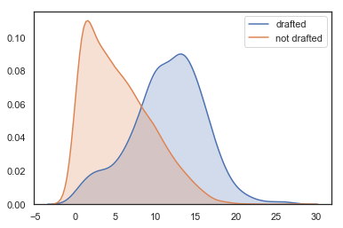

-----
## Exploratory Data Analysis  - Games Started + Field Percentage

### 3) Did players get drafted based on the amount of **games started** and **field percentage**?

Observation shows players not drafted have a 
lower field percentage while still playing an even amount of games

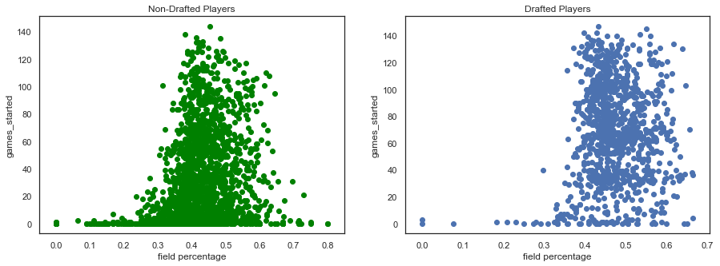

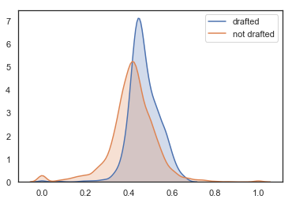

---

# Classification Models

### Models Used:
- Baseline Classifier
- Logistic Regression
- K Nearest Neighbor
- Decision Tree
- Adaboost Classifier
  
----
# Baseline Classifier 
## Model Testing 
---

Cross Validation: 
- Mean Cross Validation Score : 54.5 %
  
Train Test Split:
- Test : 33%
- Random State: 42

Accuracy Score:
- Accuracy Score : 56%

## Classification Report
---
Baseline 
- Accuracy Score : 56%
- Precision Score : 35%
- Recall Score : 31%
- F1 Score : 33%

## Baseline Classifier Confusion Matrix
---
- TP : We identified a positive draft of 453 to the NBA correctly

- TN : We identified a negative draft of 106 to the NBA correctly
- FP : We identified a positive draft of 237 to the NBA incorrectly
- FN : We identified a negative draft of 195 to the NBA incorrectly

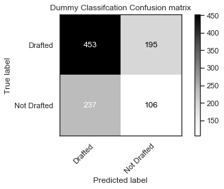

---
# Logistic Regression 
## Model Testing 

Cross Validation: 
- Mean Cross Validation Score: 82.7%
  
Train Test Split:
- Test : 33%
- Random State: 42

Accuracy Score:
- Accuracy Score : 82.4%

## Classification Report
---
Grid Search
- Mean Training Score: 81.7
- Mean Testing Score: 84.3
- Accuracy Score : 82.3%
- Precision Score : 78%
- Recall Score : 68%
- F1 Score : 73%

**Best Parameter Found**:
- {'C': 45, 'penalty': 'l1'}

## Logistic Regression Confusion Matrix
---
- TP : We identified a positive draft of 584 to the NBA correctly
- TN : We identified a negative draft of 233 to the NBA correctly
- FP : We identified a positive draft of 110 to the NBA incorrectly
- FN : We identified a negative draft of 64 to the NBA incorrectly

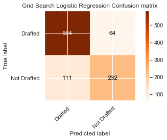

## Area Under The Curve and Receiver Operating Characteristics

1) Training Set : 88.5%
2) Test Set: 87%

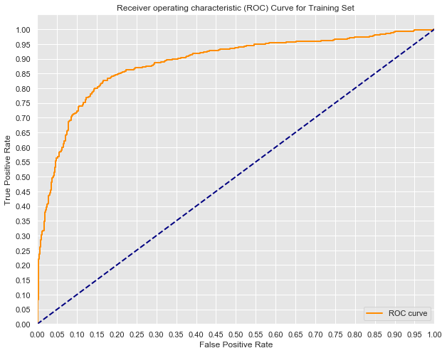

---

# K Nearrest Neighbors
## Model Testing 

Cross Validation: 
Mean Cross Validation Score: 74.79%
  
Train Test Split:
- Test : 33%
- Random State: 42

Accuracy Score:
- Accuracy Score : 82.3%

## Classification Report
---
Grid Search
- Accuracy Score : 82%
- Precision Score : 77%
- Recall Score : 67%
- F1 Score : 72%
- Best Value for K : 17

**Best Parameter Found**:
- Metric :  Manhattan
- Weights: Uniform

## Grid Search KNN Confusion Matrix
- TP : We identified a positive draft of 580  to the NBA correctly
- TN : We identified a negative draft of 229 to the NBA  correctly
- FP : We identified a positive draft of 114 to the NBA  incorrectly
- FN : We identified a negative draft of 68 to the NBA  incorrectly

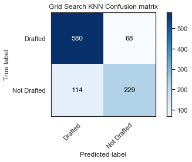

# Decision Tree
## Model Testing 

Cross Validation: 
Mean Cross Validation Score: 78.87%
  
Train Test Split:
- Test : 33%
- Random State: 42

Accuracy Score:
- Accuracy Score : 78%

## Classification Report
---
Grid Search
- Accuracy Score : 80%
- Precision Score : 75%
- Recall Score : 63%
- F1 Score : 69%

**Best Parameter Found**:
- Learning rate : 1.0
- N Estimators : 250
- Best Score : 83%

## Important Features

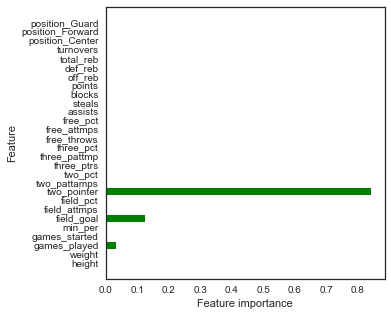

## Grid Search Decision Tree Confusion Matrix
- TP : We identified a positive draft of 579 to the NBA correctly
- TN : We identified a negative draft of 218 to the NBA correctly
- FP : We identified a positive draft of 125 to the NBA incorrectly
- FN : We identified a negative draft of 69 to the NBA incorrectly

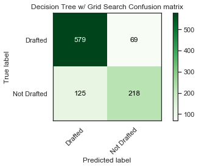

# Adaboost Classifier
## Model Testing 

Cross Validation: 
Mean Cross Validation Score: 81.9%
  
Train Test Split:
- Test : 33%
- Random State: 42

Accuracy Score:
- Accuracy Score : 81%

## Classification Report
---
Grid Search
- Accuracy Score : 82%
- Precision Score : 77%
- Recall Score : 66%
- F1 Score : 71%

**Best Parameter Found**:
- Learning rate : 1.0
- N Estimators : 250
- Best Score : 84%

## Important Features

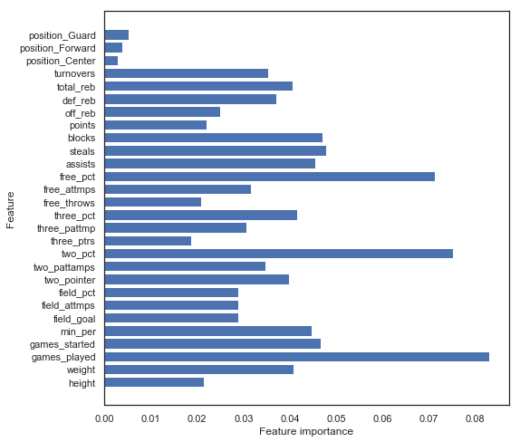

## Grid Search AdaBoost Confusion Matrix
- TP : We identified a positive draft of 581 to the NBA correctly
- TN : We identified a negative draft of 228  to the NBA correctly
- FP : We identified a positive draft of 115 to the NBA incorrectly
- FN : We identified a negative draft of 67 to the NBA incorrectly

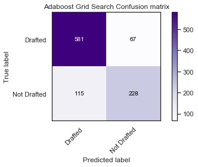

# Conclusion 
The models were able to classify college players being
drafted to the NBA correctly with 13% of misclassified players. 

The best model that perform was the logistic regression classifier.
We can conclude we will be 82% accurate at classifying if 
a college basketball player will be able to make the NBA from 
their stats and physic. 

A few adjustments that will be made to the models will be hyperparameter
tuning, random state.

